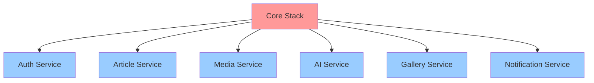

## Multi-Stack Pattern Deep Dive

### What is Multi-Stack Pattern?

Instead of deploying all infrastructure in a single CloudFormation stack, we separate resources into multiple stacks based on their lifecycle, dependencies, and blast radius.


### Stack Separation Strategy

#### Core Stack (Stateful Resources)
Contains shared, stateful resources that rarely change:
- **DynamoDB Tables**: ArticlesTable, UserProfilesTable, GalleryPhotosTable, etc.
- **S3 Buckets**: Image storage, deployment artifacts
- **Cognito User Pool**: User authentication
- **VPC & Networking**: If needed
- **IAM Roles**: Shared execution roles

**Characteristics:**
- Changes infrequently
- Shared across multiple services
- High cost of recreation
- Long deployment time (5-10 minutes)

#### Service Stacks (Stateless Resources)
Each microservice has its own stack:
- **Lambda Functions**: Service-specific business logic
- **API Gateway**: Service endpoints
- **EventBridge Rules**: Service-specific events
- **SQS Queues**: Service-specific queues
- **SNS Topics**: Service-specific notifications

**Characteristics:**
- Changes frequently
- Independent deployment
- Fast deployment (2-3 minutes)
- Low recreation cost

### Stack Separation Criteria

| Criteria | Core Stack | Service Stack |
|----------|------------|---------------|
| **Change Frequency** | Rarely (monthly) | Often (daily/weekly) |
| **State** | Stateful (data) | Stateless (compute) |
| **Sharing** | Shared across services | Service-specific |
| **Deployment Time** | Long (5-10 min) | Short (2-3 min) |
| **Blast Radius** | High (affects all) | Low (affects one service) |
| **Recreation Cost** | High (data loss risk) | Low (no data loss) |

### Benefits of Multi-Stack Pattern

#### 1. Blast Radius Reduction
**Problem**: In a monolithic stack, any change affects all resources.

**Solution**: With multi-stack, updating Article Service doesn't impact Auth or Media services.

**Example**:
```bash
# Update only Article Service
./deploy-service.sh article-service staging

# Other services (auth, media, gallery) remain untouched
```

**Impact**: 🔴 High - Prevents cascading failures

#### 2. Independent Deployment
**Problem**: Can't deploy services independently in monolithic stack.

**Solution**: Each service can be deployed, rolled back, or updated independently.

**Example**:
```bash
# Deploy new feature to Article Service
./deploy-service.sh article-service staging

# Rollback if issues found
aws cloudformation delete-stack --stack-name travel-guide-article-service-staging

# Other services continue running normally
```

**Impact**: 🔴 High - Enables continuous deployment

#### 3. Faster Deployment
**Problem**: Monolithic stack takes 15-20 minutes to deploy.

**Solution**: Service stacks deploy in 2-3 minutes.

**Comparison**:
- Monolithic Stack: 15-20 minutes (all resources)
- Core Stack: 5-10 minutes (one-time)
- Service Stack: 2-3 minutes (frequent)

**Impact**: 🟡 Medium - Improves developer productivity

#### 4. Parallel Development
**Problem**: Teams block each other when working on same stack.

**Solution**: Teams can work on different service stacks simultaneously.

**Example**:
- Team A: Updates Article Service
- Team B: Updates Media Service
- Team C: Updates Gallery Service
- No conflicts, no waiting

**Impact**: 🔴 High - Enables team scalability

#### 5. Easier Rollback
**Problem**: Rolling back monolithic stack affects all services.

**Solution**: Rollback only the affected service stack.

**Example**:
```bash
# Bug found in Article Service
aws cloudformation delete-stack --stack-name travel-guide-article-service-staging

# Redeploy previous version
git checkout v1.2.3
./deploy-service.sh article-service staging

# Auth, Media, Gallery services unaffected
```

**Impact**: 🔴 High - Reduces downtime

#### 6. Resource Limit Management
**Problem**: CloudFormation has 500 resource limit per stack.

**Solution**: Distribute resources across multiple stacks.

**Example**:
- Core Stack: ~50 resources (tables, buckets, pools)
- Each Service Stack: ~20 resources (lambdas, APIs)
- Total: 6 services × 20 = 120 resources (well under limit)

**Impact**: 🟢 Low - Prevents hitting limits

#### 7. Cost Optimization
**Problem**: Can't optimize costs per service in monolithic stack.

**Solution**: Tag and track costs per service stack.

**Example**:
```yaml
Tags:
  - Key: Service
    Value: ArticleService
  - Key: Environment
    Value: staging
  - Key: CostCenter
    Value: Engineering
```

**Impact**: 🟡 Medium - Enables cost attribution

### Comparison: Monolithic vs Multi-Stack

| Aspect | Monolithic Stack | Multi-Stack Pattern |
|--------|-----------------|---------------------|
| **Deployment Time** | 15-20 minutes | 2-3 minutes (per service) |
| **Blast Radius** | All services affected | Single service affected |
| **Rollback** | All services rolled back | Single service rolled back |
| **Team Collaboration** | Sequential (blocking) | Parallel (non-blocking) |
| **Resource Limit** | 500 (can hit limit) | 500 per stack (scalable) |
| **Cost Tracking** | Difficult | Easy (per service) |
| **Complexity** | Low (single stack) | Medium (multiple stacks) |
| **Maintenance** | Difficult (large template) | Easier (small templates) |

### Stack Dependencies



**Deployment Order**:
1. Deploy Core Stack first (provides shared resources)
2. Deploy Service Stacks in any order (parallel possible)

### Key Takeaways

1. **Separate stateful and stateless** resources into different stacks
2. **Core Stack** contains shared, rarely-changing resources
3. **Service Stacks** contain service-specific, frequently-changing resources
4. **Benefits** include faster deployments, reduced blast radius, and better team collaboration
5. **Trade-off** is increased complexity in managing multiple stacks
6. **Cross-stack references** enable resource sharing between stacks

### When to Use Multi-Stack

✅ **Use Multi-Stack when**:
- Building microservices architecture
- Multiple teams working on different services
- Frequent deployments required
- Need independent service lifecycle

❌ **Avoid Multi-Stack when**:
- Simple monolithic application
- Single team, infrequent deployments
- All resources tightly coupled
- Overhead not justified
