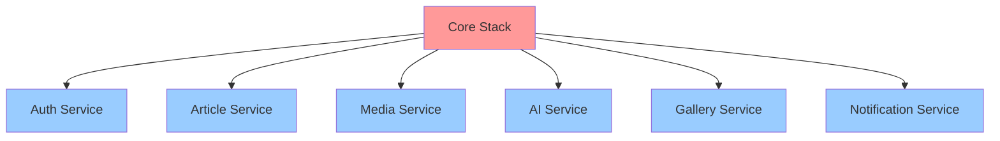

## Multi-Stack Pattern Chi Tiết

### Multi-Stack Pattern là gì?

Thay vì triển khai toàn bộ hạ tầng trong một CloudFormation stack duy nhất, chúng ta tách resources thành nhiều stacks dựa trên lifecycle, dependencies và blast radius của chúng.


### Chiến lược Tách Stack

#### Core Stack (Stateful Resources)
Chứa các shared, stateful resources ít thay đổi:
- **DynamoDB Tables**: ArticlesTable, UserProfilesTable, GalleryPhotosTable, etc.
- **S3 Buckets**: Lưu trữ ảnh, deployment artifacts
- **Cognito User Pool**: Xác thực người dùng
- **VPC & Networking**: Nếu cần
- **IAM Roles**: Shared execution roles

**Đặc điểm:**
- Thay đổi không thường xuyên
- Được chia sẻ giữa nhiều services
- Chi phí tạo lại cao
- Thời gian deploy lâu (5-10 phút)

#### Service Stacks (Stateless Resources)
Mỗi microservice có stack riêng:
- **Lambda Functions**: Business logic của service
- **API Gateway**: Service endpoints
- **EventBridge Rules**: Service-specific events
- **SQS Queues**: Service-specific queues
- **SNS Topics**: Service-specific notifications

**Đặc điểm:**
- Thay đổi thường xuyên
- Deploy độc lập
- Deploy nhanh (2-3 phút)
- Chi phí tạo lại thấp

### Tiêu chí Tách Stack

| Tiêu chí | Core Stack | Service Stack |
|----------|------------|---------------|
| **Tần suất thay đổi** | Hiếm (hàng tháng) | Thường (hàng ngày/tuần) |
| **State** | Stateful (data) | Stateless (compute) |
| **Chia sẻ** | Shared giữa services | Riêng từng service |
| **Thời gian Deploy** | Lâu (5-10 phút) | Nhanh (2-3 phút) |
| **Blast Radius** | Cao (ảnh hưởng tất cả) | Thấp (ảnh hưởng 1 service) |
| **Chi phí tạo lại** | Cao (rủi ro mất data) | Thấp (không mất data) |

### Lợi ích của Multi-Stack Pattern

#### 1. Giảm Blast Radius
**Vấn đề**: Trong monolithic stack, mọi thay đổi đều ảnh hưởng tất cả resources.

**Giải pháp**: Với multi-stack, update Article Service không ảnh hưởng Auth hay Media services.

**Ví dụ**:
```bash
# Chỉ update Article Service
./deploy-service.sh article-service staging

# Các services khác (auth, media, gallery) không bị ảnh hưởng
```

**Tác động**: 🔴 Cao - Ngăn chặn cascading failures

#### 2. Deploy Độc Lập
**Vấn đề**: Không thể deploy services độc lập trong monolithic stack.

**Giải pháp**: Mỗi service có thể deploy, rollback hoặc update độc lập.

**Ví dụ**:
```bash
# Deploy tính năng mới cho Article Service
./deploy-service.sh article-service staging

# Rollback nếu có vấn đề
aws cloudformation delete-stack --stack-name travel-guide-article-service-staging

# Các services khác vẫn chạy bình thường
```

**Tác động**: 🔴 Cao - Cho phép continuous deployment

#### 3. Deploy Nhanh Hơn
**Vấn đề**: Monolithic stack mất 15-20 phút để deploy.

**Giải pháp**: Service stacks chỉ mất 2-3 phút.

**So sánh**:
- Monolithic Stack: 15-20 phút (tất cả resources)
- Core Stack: 5-10 phút (một lần)
- Service Stack: 2-3 phút (thường xuyên)

**Tác động**: 🟡 Trung bình - Cải thiện năng suất developer

#### 4. Phát Triển Song Song
**Vấn đề**: Teams chặn nhau khi làm việc trên cùng stack.

**Giải pháp**: Teams có thể làm việc trên các service stacks khác nhau đồng thời.

**Ví dụ**:
- Team A: Update Article Service
- Team B: Update Media Service
- Team C: Update Gallery Service
- Không xung đột, không chờ đợi

**Tác động**: 🔴 Cao - Cho phép team scale

#### 5. Rollback Dễ Dàng
**Vấn đề**: Rollback monolithic stack ảnh hưởng tất cả services.

**Giải pháp**: Chỉ rollback service stack bị ảnh hưởng.

**Ví dụ**:
```bash
# Phát hiện bug trong Article Service
aws cloudformation delete-stack --stack-name travel-guide-article-service-staging

# Redeploy phiên bản trước
git checkout v1.2.3
./deploy-service.sh article-service staging

# Auth, Media, Gallery services không bị ảnh hưởng
```

**Tác động**: 🔴 Cao - Giảm downtime

#### 6. Quản Lý Resource Limit
**Vấn đề**: CloudFormation có giới hạn 500 resources mỗi stack.

**Giải pháp**: Phân tán resources qua nhiều stacks.

**Ví dụ**:
- Core Stack: ~50 resources (tables, buckets, pools)
- Mỗi Service Stack: ~20 resources (lambdas, APIs)
- Tổng: 6 services × 20 = 120 resources (dưới giới hạn)

**Tác động**: 🟢 Thấp - Tránh đạt giới hạn

#### 7. Tối Ưu Chi Phí
**Vấn đề**: Không thể tối ưu chi phí theo service trong monolithic stack.

**Giải pháp**: Tag và theo dõi chi phí theo service stack.

**Ví dụ**:
```yaml
Tags:
  - Key: Service
    Value: ArticleService
  - Key: Environment
    Value: staging
  - Key: CostCenter
    Value: Engineering
```

**Tác động**: 🟡 Trung bình - Cho phép phân bổ chi phí

### So sánh: Monolithic vs Multi-Stack

| Khía cạnh | Monolithic Stack | Multi-Stack Pattern |
|-----------|-----------------|---------------------|
| **Thời gian Deploy** | 15-20 phút | 2-3 phút (mỗi service) |
| **Blast Radius** | Tất cả services bị ảnh hưởng | Chỉ 1 service bị ảnh hưởng |
| **Rollback** | Tất cả services rollback | Chỉ 1 service rollback |
| **Cộng tác Team** | Tuần tự (blocking) | Song song (non-blocking) |
| **Resource Limit** | 500 (có thể đạt giới hạn) | 500 mỗi stack (scalable) |
| **Theo dõi Chi phí** | Khó | Dễ (theo service) |
| **Độ phức tạp** | Thấp (single stack) | Trung bình (multiple stacks) |
| **Bảo trì** | Khó (template lớn) | Dễ hơn (templates nhỏ) |

### Dependencies giữa Stacks



**Thứ tự Deploy**:
1. Deploy Core Stack trước (cung cấp shared resources)
2. Deploy Service Stacks theo thứ tự bất kỳ (có thể song song)

### Điểm Chính

1. **Tách stateful và stateless** resources vào các stacks khác nhau
2. **Core Stack** chứa shared, ít thay đổi resources
3. **Service Stacks** chứa service-specific, thường thay đổi resources
4. **Lợi ích** bao gồm deploy nhanh hơn, giảm blast radius, cộng tác team tốt hơn
5. **Trade-off** là tăng độ phức tạp trong quản lý nhiều stacks
6. **Cross-stack references** cho phép chia sẻ resources giữa stacks

### Khi nào dùng Multi-Stack

✅ **Dùng Multi-Stack khi**:
- Xây dựng kiến trúc microservices
- Nhiều teams làm việc trên các services khác nhau
- Cần deploy thường xuyên
- Cần lifecycle độc lập cho từng service

❌ **Tránh Multi-Stack khi**:
- Ứng dụng monolithic đơn giản
- Single team, deploy không thường xuyên
- Tất cả resources liên kết chặt chẽ
- Overhead không xứng đáng
