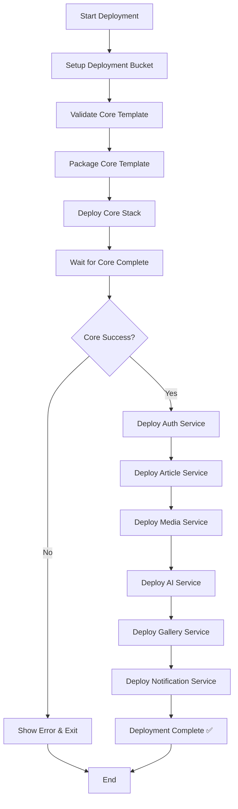

## Deployment Orchestration with Bash Scripts

### Overview

Deployment orchestration automates the process of deploying multiple CloudFormation stacks in the correct order with proper error handling and validation.

### Deployment Scripts Architecture

```
scripts/
├── deploy.sh              # Main orchestration script
├── deploy-core.sh         # Core stack deployment
├── deploy-service.sh      # Service stack deployment template
└── utils.sh               # Shared utility functions
```

### Main Orchestration Script

**deploy.sh** - Orchestrates the entire deployment:

```bash
#!/bin/bash
set -e  # Exit on error
set -o pipefail  # Catch errors in pipes

# Configuration
ENVIRONMENT=${1:-staging}
REGION=${2:-us-east-1}
CORE_STACK_NAME="travel-guide-core-${ENVIRONMENT}"

# Colors for output
RED='\033[0;31m'
GREEN='\033[0;32m'
YELLOW='\033[1;33m'
NC='\033[0m' # No Color

# Error handling
trap 'echo -e "${RED}❌ Deployment failed${NC}"; exit 1' ERR

echo -e "${GREEN}🚀 Starting deployment to ${ENVIRONMENT}${NC}"

# Step 1: Setup deployment bucket
echo "📦 Setting up deployment bucket..."
./scripts/setup-bucket.sh $ENVIRONMENT $REGION

# Step 2: Deploy Core Stack
echo "🏗️  Deploying Core Stack..."
./scripts/deploy-core.sh $ENVIRONMENT $REGION

# Wait for core stack to complete
echo "⏳ Waiting for Core Stack..."
aws cloudformation wait stack-create-complete \
    --stack-name $CORE_STACK_NAME \
    --region $REGION || \
aws cloudformation wait stack-update-complete \
    --stack-name $CORE_STACK_NAME \
    --region $REGION

# Verify core stack status
CORE_STATUS=$(aws cloudformation describe-stacks \
    --stack-name $CORE_STACK_NAME \
    --region $REGION \
    --query 'Stacks[0].StackStatus' \
    --output text)

if [[ ! $CORE_STATUS =~ (CREATE_COMPLETE|UPDATE_COMPLETE) ]]; then
    echo -e "${RED}❌ Core stack deployment failed: $CORE_STATUS${NC}"
    exit 1
fi

echo -e "${GREEN}✅ Core Stack deployed successfully${NC}"

# Step 3: Deploy Service Stacks
SERVICES=("auth" "articles" "media" "ai" "gallery" "notification")

for service in "${SERVICES[@]}"; do
    echo "🔧 Deploying ${service} service..."
    ./scripts/deploy-service.sh $service $ENVIRONMENT $REGION
    
    # Optional: Wait for each service (sequential)
    # Or deploy all in parallel and wait at the end
done

echo -e "${GREEN}✅ All services deployed successfully${NC}"
echo -e "${YELLOW}📊 Deployment Summary:${NC}"
echo "  Environment: $ENVIRONMENT"
echo "  Region: $REGION"
echo "  Core Stack: $CORE_STACK_NAME"
echo "  Services: ${SERVICES[@]}"
```

### Core Stack Deployment Script

**deploy-core.sh**:

```bash
#!/bin/bash
set -e

ENVIRONMENT=$1
REGION=$2
STACK_NAME="travel-guide-core-${ENVIRONMENT}"
TEMPLATE_FILE="infrastructure/core/template.yaml"
PARAMS_FILE="infrastructure/parameters/${ENVIRONMENT}.json"

echo "Deploying Core Stack: $STACK_NAME"

# Validate template
echo "Validating template..."
aws cloudformation validate-template \
    --template-body file://$TEMPLATE_FILE \
    --region $REGION

# Convert parameters
params_override=$(python3 -c "import json, sys; \
    data=json.load(open('$PARAMS_FILE')); \
    print(' '.join([f'ParameterKey={k},ParameterValue={v}' \
    for k,v in data.items()]))")

# Package SAM template (if using SAM)
echo "Packaging template..."
sam package \
    --template-file $TEMPLATE_FILE \
    --s3-bucket travel-guide-deployment-${ENVIRONMENT} \
    --output-template-file /tmp/core-packaged.yaml \
    --region $REGION

# Deploy stack
echo "Deploying stack..."
aws cloudformation deploy \
    --template-file /tmp/core-packaged.yaml \
    --stack-name $STACK_NAME \
    --parameter-overrides $params_override \
    --capabilities CAPABILITY_IAM CAPABILITY_NAMED_IAM \
    --region $REGION \
    --no-fail-on-empty-changeset

echo "✅ Core Stack deployed: $STACK_NAME"
```

### Service Stack Deployment Script

**deploy-service.sh**:

```bash
#!/bin/bash
set -e

SERVICE=$1
ENVIRONMENT=$2
REGION=$3
CORE_STACK_NAME="travel-guide-core-${ENVIRONMENT}"
STACK_NAME="travel-guide-${SERVICE}-service-${ENVIRONMENT}"
TEMPLATE_FILE="infrastructure/services/${SERVICE}/template.yaml"

echo "Deploying Service: $SERVICE"

# Validate template
aws cloudformation validate-template \
    --template-body file://$TEMPLATE_FILE \
    --region $REGION

# Package template
sam package \
    --template-file $TEMPLATE_FILE \
    --s3-bucket travel-guide-deployment-${ENVIRONMENT} \
    --output-template-file /tmp/${SERVICE}-packaged.yaml \
    --region $REGION

# Deploy with core stack reference
aws cloudformation deploy \
    --template-file /tmp/${SERVICE}-packaged.yaml \
    --stack-name $STACK_NAME \
    --parameter-overrides \
        CoreStackName=$CORE_STACK_NAME \
        Environment=$ENVIRONMENT \
    --capabilities CAPABILITY_IAM CAPABILITY_NAMED_IAM \
    --region $REGION \
    --no-fail-on-empty-changeset

echo "✅ Service deployed: $SERVICE"
```

### Deployment Flow Diagram



### Error Handling

**Comprehensive error handling**:

```bash
#!/bin/bash

# Exit on any error
set -e

# Exit on undefined variable
set -u

# Catch errors in pipes
set -o pipefail

# Cleanup function
cleanup() {
    local exit_code=$?
    if [ $exit_code -ne 0 ]; then
        echo "❌ Deployment failed with exit code: $exit_code"
        echo "📋 Check CloudFormation events for details:"
        echo "aws cloudformation describe-stack-events --stack-name $STACK_NAME"
    fi
}

# Register cleanup on exit
trap cleanup EXIT

# Error handler for specific commands
deploy_with_retry() {
    local max_attempts=3
    local attempt=1
    
    while [ $attempt -le $max_attempts ]; do
        echo "Attempt $attempt of $max_attempts..."
        
        if aws cloudformation deploy "$@"; then
            echo "✅ Deployment successful"
            return 0
        fi
        
        echo "⚠️  Attempt $attempt failed"
        attempt=$((attempt + 1))
        sleep 10
    done
    
    echo "❌ All attempts failed"
    return 1
}
```

### Rollback Strategies

**Automatic Rollback**:
```bash
# CloudFormation automatically rolls back on failure
aws cloudformation deploy \
    --template-file template.yaml \
    --stack-name my-stack \
    --disable-rollback false  # Default behavior
```

**Manual Rollback**:
```bash
# Delete failed stack
aws cloudformation delete-stack --stack-name my-stack

# Redeploy previous version
git checkout v1.2.3
./deploy.sh staging
```

**Rollback to Previous Version**:
```bash
# List stack versions
aws cloudformation list-stacks \
    --stack-status-filter CREATE_COMPLETE UPDATE_COMPLETE

# Rollback using previous template
aws cloudformation update-stack \
    --stack-name my-stack \
    --use-previous-template
```

### Validation Steps

**Pre-deployment validation**:

```bash
# 1. Validate template syntax
aws cloudformation validate-template \
    --template-body file://template.yaml

# 2. Lint template (using cfn-lint)
cfn-lint template.yaml

# 3. Check parameter file
jq empty < parameters/staging.json

# 4. Verify AWS credentials
aws sts get-caller-identity

# 5. Check stack dependencies
aws cloudformation list-exports \
    --query "Exports[?Name=='travel-guide-core-staging-ArticlesTableName']"
```

### Parallel Deployment

**Deploy services in parallel** (faster):

```bash
#!/bin/bash

SERVICES=("auth" "articles" "media" "ai" "gallery" "notification")

# Deploy all services in background
for service in "${SERVICES[@]}"; do
    ./scripts/deploy-service.sh $service $ENVIRONMENT $REGION &
done

# Wait for all background jobs
wait

echo "✅ All services deployed"
```

### Key Takeaways

1. **Orchestration scripts** automate multi-stack deployment
2. **Error handling** prevents partial deployments
3. **Validation** catches issues before deployment
4. **Rollback strategies** enable quick recovery
5. **Parallel deployment** speeds up process
6. **Logging** helps debug issues

### Best Practices

1. **Always validate** templates before deployment
2. **Use set -e** to exit on errors
3. **Implement retry logic** for transient failures
4. **Log all operations** for debugging
5. **Test scripts** in staging before production
6. **Document deployment process** in README
